# local-nginx

## Environment

- Shell: bash
- Docker: `19.0.12`
    - docker-compose: `1.26.0`

### Initialize
```bash
# ./n に実行権限付与
$ chmod +x ./n

# Dockerプロジェクト展開
$ ./n init
```

### Setup
```bash
# dockerコンテナ起動
$ ./n up -d

# => reverse proxy from ./config
```

***

## SSHポートフォワーディングを利用した localhost サーバ公開

下図のようにSSHトンネルを利用することで、中継サーバを経由してローカルサーバにアクセスすることができる



### SSHポートフォワーディング機能の有効化
```bash
# 中継サーバに接続
$ ssh centos@123.45.6.7

# -- centos@123.45.6.7

# sshd_config を修正してSSHポートフォワーディングを有効化する
$ sudo sed -i 's/^#\?\s*GatewayPorts.*/GatewayPorts yes/' /etc/ssh/sshd_config
$ sudo systemctl restart sshd.service

# 中継サーバから抜ける
$ exit
```

### SSHトンネルの作成
```bash
# SSHポートフォワーディングにより 123.45.6.7:2280 -> localhost:8080 に転送するトンネルを作成
$ ssh -R 2280:localhost:8080 centos@123.45.6.7
```

これにより http://123.45.6.7:2280 にアクセスすると http://localhost:8080 のレスポンスが返るようになる

### autosshコマンドによるSSH接続の永続化
sshコマンドの代わりにautosshコマンドを使えば、SSH接続が切れても自動で再接続されるようになる

なお、autosshコマンドはsshコマンドと全く同一のコマンドラインオプションを使用可能である

```bash
# autosshコマンドで 123.45.6.7:2280 -> localhost:8080 のトンネル作成
## -Nオプションでssh接続後のコマンド実行を待機可能
$ autossh -R 2280:localhost:8080 -N centos@123.45.6.7
```
